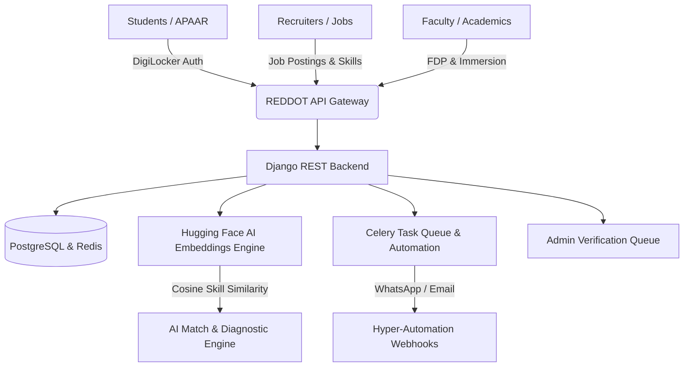

# 🚀 REDDOT — Smart India Hackathon 2026 (Problem Statement ID: 26044)
## Official Pitch Deck, 3-Minute Speech Script & Judges Q&A Defense Kit

---

## 📑 SECTION 1: 10-SLIDE PRESENTATION BLUEPRINT

### Slide 1: Title & Introduction
- **Header**: REDDOT — AI-Powered Academia-Industry Collaboration Platform
- **Sub-header**: Bridging the 80% Employability Gap through Smart Automation & Skill Mapping
- **Problem Statement ID**: 26044 | **Theme**: Smart Automation | **Category**: Software
- **Team**: Team REDDOT
- **Tagline**: *"Every Student Job-Ready, Every Faculty Industry-Connected, Every Recruiter Instantly Matched."*
- **Key Badges Displayed**: AICTE IFP Aligned | NEP 2020 Compliant | DigiLocker & APAAR Integrated

### Slide 2: The Core Problem (The Reality of Indian Higher Ed)
- **Statistic 1**: Over **15 Lakh Engineering & Degree graduates** pass out annually in India; yet industry reports (NASSCOM / Wheebox) show **only ~45-50% are immediately employable**.
- **Statistic 2**: Recruiters spend **3 to 5 weeks** filtering thousands of unverified resumes, suffering high attrition and mismatched skills.
- **Statistic 3**: Faculty members lack direct corporate exposure; curriculum updates lag industry demand by 3-5 years.
- **Root Cause**: Fragmented silos between Colleges (curriculum), Students (isolated learning), and Industry (rapidly changing requirements).

### Slide 3: The Solution — REDDOT Ecosystem
- **What is REDDOT?**: A unified 4-stakeholder ecosystem powered by AI automation.
- **1. Students**: 15-question adaptive Skill Diagnostics, Skill Gap Radar, AI Career Coach (Mock Interviews & ATS Resume Optimizer), and verified digital portfolios.
- **2. Recruiters**: Pre-evaluated candidate pipelines, AI Match Scoring (>85% precision), 1-click WhatsApp/Telegram hyper-automation approvals, 40% faster hiring.
- **3. Faculty**: AICTE Industrial Immersion tracking, Faculty Development Programs (FDP), industry research matchmaking.
- **4. Institutions/Admin**: Real-time DigiLocker/APAAR verification queue, automated NAAC/NIRF Criterion 5 report generation.

### Slide 4: System Architecture & Workflow

### Slide 5: Key Technical Innovation — Smart Automation
- **Semantic Skill Vectorization**: Instead of simple keyword matching, we embed job requirements and candidate profiles using Hugging Face `all-MiniLM-L6-v2` vectors to calculate multidimensional cosine similarity.
- **Automated Verification Pipeline**: Integration with **APAAR (Automated Permanent Academic Account Registry)** and **DigiLocker API** verifying marks, degrees, and bona-fide identity in seconds.
- **Hyper-Automated Recruiter Workflow**: Asynchronous webhook triggers notifying recruiters on mobile with one-tap shortlist/reject buttons.
- **Automated NIRF/NAAC Metric Generation**: Instant aggregation of student placement percentage, median salary, and faculty industrial exposure reports.

### Slide 6: Deep Dive — AI Career Coach & Skill Diagnostic Flow
- **Adaptive Skill Diagnostic (C3/C4)**: 15 targeted questions categorized by difficulty, real-time timer, producing:
  - Overall Employability Score vs National Industry Benchmark
  - Skill-wise radar/breakdown highlighting deficiencies in **RED**
  - Week-by-week personalized learning roadmap linked to open-source and MOOC courses.
- **AI Career Coach (C9)**:
  - **Mock Interview Simulator**: Real-time Web Audio API voice input with automated AI assessment of clarity, technical depth, and confidence.
  - **Resume ATS Optimizer**: Real-time PDF parsing extracting tech stack and calculating keyword match against specific job descriptions.

### Slide 7: Stakeholder Benefits & Value Proposition
| Stakeholder | Before REDDOT | With REDDOT |
|---|---|---|
| **Students** | Submitting 100+ blind resumes, no feedback on skill gaps | Instant gap diagnosis, targeted roadmap, verified credentials |
| **Recruiters** | Weeks spent screening fake claims & generic CVs | Pre-vetted candidates with AI match scores, 40% hiring cycle cut |
| **Faculty** | Isolated from modern industry tools | Sponsored FDPs, AICTE industrial immersion internships |
| **Colleges** | Manual spreadsheet tracking for NAAC/NIRF audits | 1-click automated accreditation reports & verified placement data |

### Slide 8: Live Product Demonstration
- **Screen D1**: Recruiter Dashboard with real-time candidate match scores & status pipeline.
- **Screen C3/C4**: Skill Diagnostic quiz, gauge visualizations, and roadmap generation.
- **Screen C9**: AI Career Coach mock interview & resume ATS analyzer.
- **Screen F3**: Admin verification queue showing DigiLocker preview & bulk approve.

### Slide 9: Scalability, Security & Compliance
- **Scalability**: Microservices-ready containerized Docker architecture, stateless DRF endpoints, Redis cache layer, PostgreSQL read replicas.
- **Data Privacy & DPDP Act 2023**:
  - Explicit user consent for recruiter data sharing.
  - AES-256 encryption for stored academic documents and hashed APAAR IDs.
  - Strict Role-Based Access Control (RBAC) preventing unauthorized data leaks.
- **AI Ethics & Bias Mitigation**: Demographically blind embedding vectors focusing 100% on demonstrable skills and test results.

### Slide 10: Future Roadmap & Impact
- **Phase 1 (Current MVP - SIH 2026)**: Core 23 screens, AI matching, DigiLocker verification mock, diagnostic & recruiter dashboards.
- **Phase 2 (6 Months)**: State-wide university pilot (50+ colleges), integration with live DigiLocker production gateways & LMS platforms (NPTEL/SWAYAM).
- **Phase 3 (12 Months)**: Pan-India deployment, corporate sponsored sandbox projects, multilingual voice support in 8 regional languages.

---

## 🎤 SECTION 2: 3-MINUTE WINNING SPEECH SCRIPT

> **Pacing Tip**: Speak with confidence, energy, and deliberate pauses. Keep eyes on judges.

**(0:00 - 0:30) The Hook & The Problem**
> *"Respected Judges, every year India produces over 1.5 million graduates. Yet, nearly 50% are deemed unemployable on day one. Why? Because academia teaches the syllabus of yesterday, while industry hires for the tech stack of tomorrow. Students don't know what they lack, recruiters drown in unverified resumes, and faculty rarely get industrial immersion. 
> To bridge this critical divide for Smart India Hackathon Problem 26044, my team has built **REDDOT** — India’s premier AI-powered Academia-Industry Collaboration Platform."*

**(0:30 - 1:15) The Solution & Core Differentiators**
> *"REDDOT is not just another job portal. It is an end-to-end smart automation ecosystem uniting four key stakeholders: Students, Recruiters, Faculty, and Administrators.
> When a student registers, their academic records are authenticated via **APAAR and DigiLocker**. They take our adaptive 15-question AI Skill Diagnostic. Within seconds, REDDOT generates a comprehensive Skill Gap Radar, highlighting exact weaknesses in red, and auto-generates a personalized 6-week learning roadmap.
> Furthermore, with our built-in **AI Career Coach**, students can conduct voice-enabled mock interviews and optimize their resumes for ATS screening before applying."*

**(1:15 - 2:05) The Recruiter & Faculty Advantage**
> *"On the recruiter side, REDDOT utilizes Hugging Face semantic embeddings to match job descriptions with student capability vectors. Recruiters don’t read hundreds of pages — they see pre-evaluated candidates with an 85%+ match score. With our hyper-automation trigger, HR teams can shortlist or schedule interviews in a single click directly from WhatsApp or Telegram.
> For faculty, we automate AICTE Industrial Immersion tracking and FDP matchmaking, ensuring educators stay aligned with cutting-edge industry practices. And for institutions, REDDOT generates one-click NAAC Criterion 5 and NIRF placement reports, saving hundreds of administrative man-hours."*

**(2:05 - 2:40) Live Architecture & Tech Stack**
> *"Our platform is built on a resilient, production-ready stack: React Vite on the frontend with modern glassmorphic Tailwind UI, Django REST Framework on the backend, PostgreSQL database, and asynchronous Celery workers. Everything is compliant with India’s Digital Personal Data Protection Act 2023, utilizing AES-256 encryption."*

**(2:40 - 3:00) Conclusion & Vision**
> *"REDDOT transforms campus placements from a seasonal panic into a continuous, data-driven career pipeline. We are empowering students, empowering faculty, and giving Indian industry the workforce it deserves. 
> Thank you, and we are now excited to demonstrate REDDOT live and answer your questions!"*

---

## 💡 SECTION 3: BULLETPROOF ANSWERS TO JUDGES' QUESTIONS

### Q1: How does your solution specifically embody "Smart Automation"?
**Answer**:
> *"Smart Automation in REDDOT is embedded at three distinct architectural levels:
> 1. **Automated Verification Pipeline**: Instead of manual college admin checks, we automate identity and credential validation via APAAR and DigiLocker API hooks.
> 2. **AI Skill Diagnostics & Dynamic Roadmap Engine**: As soon as a student completes the 15-question diagnostic, our algorithm identifies negative delta gaps against live market job openings and dynamically constructs a curated weekly syllabus.
> 3. **Hyper-Automated Recruiter Workflows**: Using Celery background queues and webhook integrations (e.g., n8n/WhatsApp Business API), recruiters receive automated daily digests of high-probability matches with interactive 'Shortlist' / 'Reject' triggers without having to log into a portal."*

### Q2: How is your solution scalable to millions of students across India?
**Answer**:
> *"We designed REDDOT with cloud-native scalability in mind:
> - **Stateless Django REST API**: Backend workers can scale horizontally behind an NGINX reverse proxy or Kubernetes cluster.
> - **Caching & Database Optimization**: Heavy read queries (such as job feeds and public profiles) are cached in Redis with sub-10ms latency. PostgreSQL utilizes connection pooling (PgBouncer) and read-replicas.
> - **Asynchronous AI Inference**: Embedding calculations and PDF parsing are offloaded to background Celery workers, ensuring the user-facing web app remains blazing fast with sub-second page loads."*

### Q3: How do you ensure Data Privacy and compliance with Indian laws?
**Answer**:
> *"REDDOT is designed ground-up in compliance with the **Digital Personal Data Protection (DPDP) Act 2023**:
> - **Explicit Consent Architecture**: Recruiter access to student contact details requires explicit, granular student consent.
> - **Data Minimization & Encryption**: Academic records fetched via DigiLocker are stored with AES-256 encryption at rest and TLS 1.3 in transit.
> - **Strict Role-Based Access Control (RBAC)**: Enforced via cryptographic JWT tokens where student, recruiter, faculty, and institute permissions are strictly partitioned.
> - **Right to Erasure**: Students have a 1-click 'Export My Data' and 'Delete Account' button complying with statutory privacy mandates."*

### Q4: What is your Monetization & Financial Sustainability strategy?
**Answer**:
> *"We operate a sustainable hybrid B2B/B2G model:
> 1. **Institutional SaaS Subscription**: Colleges pay an annual tier (₹50,000 to ₹1,50,000/yr) for automated NAAC/NIRF accreditation analytics, centralized placement cell management, and verified student portfolios.
> 2. **Recruiter Freemium Model**: Basic job postings are free; advanced AI candidate vector matching, automated interview scheduling, and campus drive management carry a per-hire or monthly subscription fee.
> 3. **Corporate CSR & Sponsored FDPs**: Industry partners sponsor targeted Faculty Development Programs and skill-bounties to build custom talent pipelines."*

### Q5: How do you handle AI Bias in candidate screening?
**Answer**:
> *"Algorithmic fairness is a foundational pillar of REDDOT:
> 1. **Demographic Blindness**: Our Hugging Face embedding vectors and scoring algorithms only ingest objective parameters — verifiable skills, project technical stacks, diagnostic scores, and coursework. Demographics like gender, caste, location, and photo are strictly stripped from the AI matching pipeline.
> 2. **Human-in-the-Loop Safeguards**: AI never auto-rejects candidates; it provides an advisory match percentage (e.g., 92% Match) with a transparent breakdown explaining *why* the score was awarded.
> 3. **Continuous Auditing**: We log match distributions across colleges to prevent bias toward premier tier-1 institutions over tier-2/3 regional colleges."*

---

## 🌟 SECTION 4: REDDOT UNIQUE SELLING POINTS (USPs)
1. **Tri-Stakeholder Synergy**: Unlike LinkedIn (recruiter-student) or LMS (student-only), REDDOT actively incorporates **Faculty** through industrial immersion, solving the problem at the pedagogical root.
2. **National ID Integration (APAAR & DigiLocker)**: Eliminates resume fraud and fake credential inflation completely.
3. **Hyper-Automation First**: Reduces hiring cycle latency from weeks to hours via automated multi-channel triggers.
4. **Actionable Gap Remediation**: When a student is not matched, we don't just say 'Rejected' — we generate the exact 6-week curriculum to get them hired.
